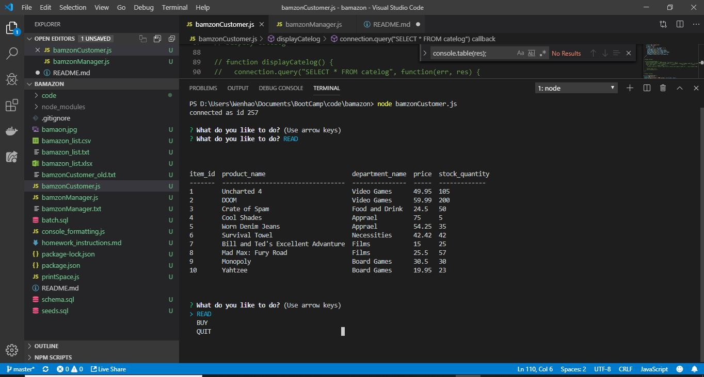
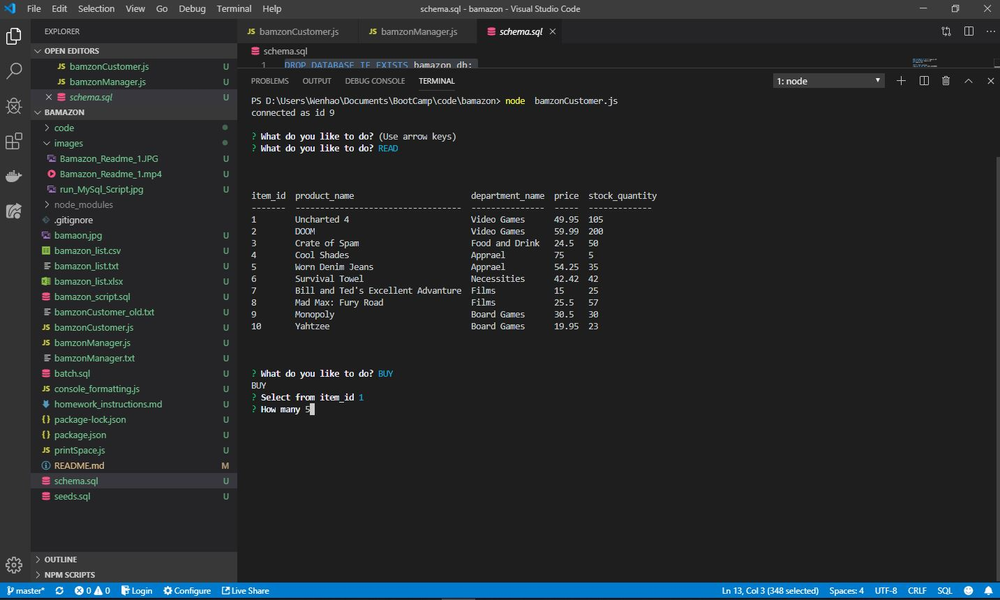
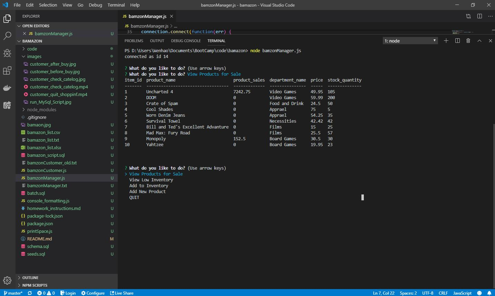
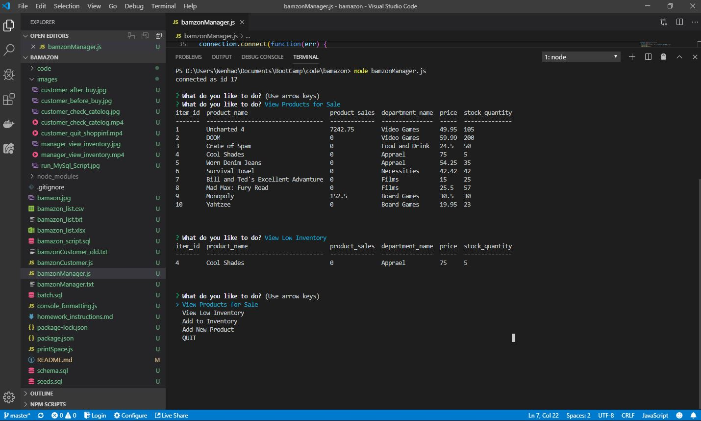
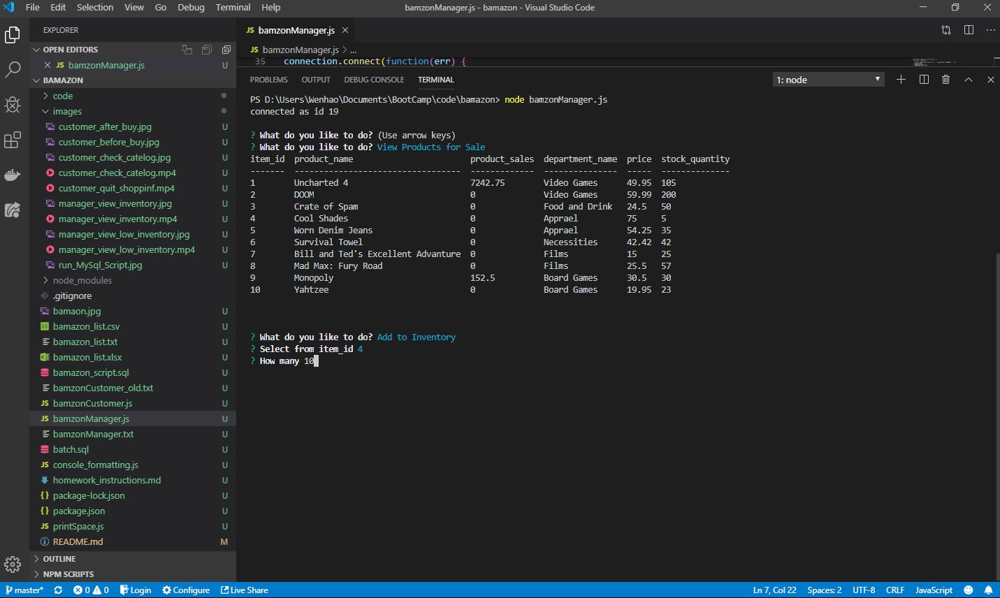
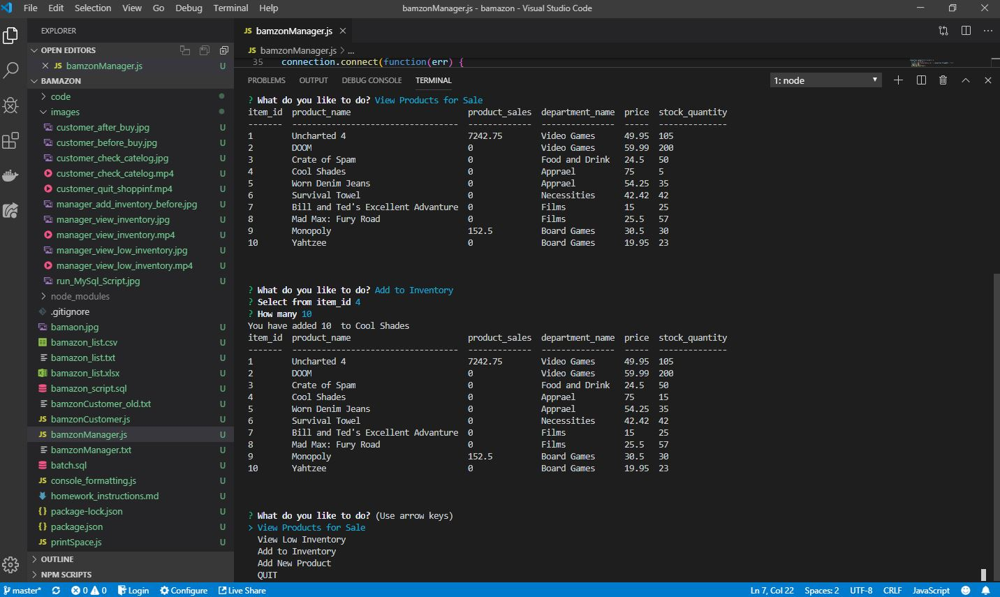
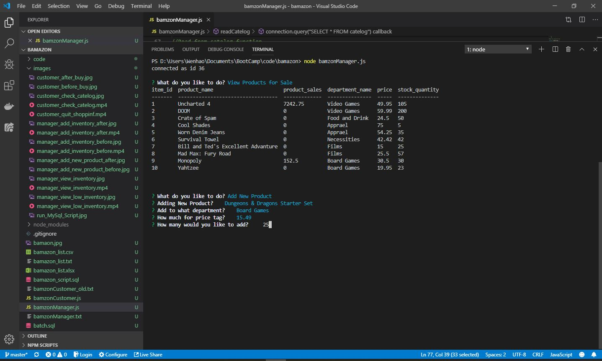

# bamazon | Node.js &amp; MySQL
# Node.js & MySQL

## Overview

In this activity, I have created an Amazon-like storefront with the MySQL skills you learned this unit. The app will take in orders from customers and deplete stock from the store's inventory. As a bonus task, you can program your app to track product sales across your store's departments and then provide a summary of the highest-grossing departments in the store.

### Customer View (Process as following)

1. Create a MySQL Database called `bamazon`.

2. Then create a Table inside of that database called `catelog`.

3. The catelog table should have each of the following columns:

   * item_id (unique id for each product)

   * product_name (Name of product)

   * department_name

   * price (cost to customer)

   * stock_quantity (how much of the product is available in stores)

4. Populate database with around 10 different products.

5. create a Node application called `bamazonCustomer.js`. Running this application will first display all of the items available for sale. Include the ids, names, and prices of products for sale.

6. The app will prompt users with two messages.

   * The first should ask them the ID of the product they would like to buy.
   * The second message should ask how many units of the product they would like to buy.

7. Once the customer has placed the order, The application will check if store has enough of the product to meet the customer's request.

   * If not, the app should log a phrase like `Low Inventory!`, and then prevent the order from going through.

8. However, if the store _does_ have enough of the product, this applicatiion will fulfill the customer's order.
   * This means updating the SQL database to reflect the remaining quantity.
   * Once the update goes through, show the customer the total cost of their purchase.

- - -

- - -

### Challenge #2: Manager View (Next Level)

* Create a new Node application called `bamazonManager.js`. Running this application will:

  * List a set of menu options:

    * View Products for Sale
    
    * View Low Inventory
    
    * Add to Inventory
    
    * Add New Product

  * If a manager selects `View Products for Sale`, the app should list every available item: the item IDs, names, prices, and quantities.

  * If a manager selects `View Low Inventory`, then it should list all items with an inventory count lower than five.

  * If a manager selects `Add to Inventory`, your app should display a prompt that will let the manager "add more" of any item currently in the store.

  * If a manager selects `Add New Product`, it should allow the manager to add a completely new product to the store.

- - -

- - -
